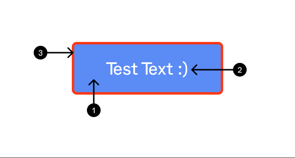

# Applying Colors
Gaia's guidelines to applying colors to an element.

## Component Color Anatomy
When applying color to a component, we generally apply it to three main parts of an element/component:

1) The container itself
2) The content inside
3) The borders



### Fill
The fill color is the color applied to the container itself. This generally comprises about 70% of an element's color.
The fill color is commonly associated with the `background-color` CSS property.

#### SCSS
For the API information, please visit the [color composition API page](../../api/composition/color.md).

```scss
@use 'node_modules/@growstocks/gaia';

.gs-component {
  @include gaia.color-fill('component', gaia.token-get('color.token'));
}
```

### Ink
The ink color is the color applied to the content inside the component, usually text. The ink color is commonly
associated with the `color` CSS property.

#### SCSS
For the API information, please visit the [color composition API page](../../api/composition/color.md).

```scss
@use 'node_modules/@growstocks/gaia';

.gs-component {
  @include gaia.color-ink('component', gaia.token-get('color.token'));
}
```

### Border
The border color is the color applied to the edges of an element. The border color is commonly associated with the `border-color` CSS property.

#### SCSS
For the API information, please visit the [color composition API page](../../api/composition/color.md).

```scss
@use 'node_modules/@growstocks/gaia';

.gs-component {
  @include gaia.color-border('component', gaia.token-get('color.token'));
}
```

## Applying the colors together
Gaia provides an SCSS mixin that lets you apply all three in one go. It's the `color-apply()` mixin. It takes the component name, and the color map.

For the API information, please visit the [color composition API page](../../api/composition/color.md).

```scss
@use 'node_modules/@growstocks/gaia';

.gs-component {
  @include gaia.color-apply('component', (
    fill: gaia.token-get('color.token'),
    ink: gaia.token-get('color.token'),
    border: gaia.token-get('color.token')
  ));
}
```